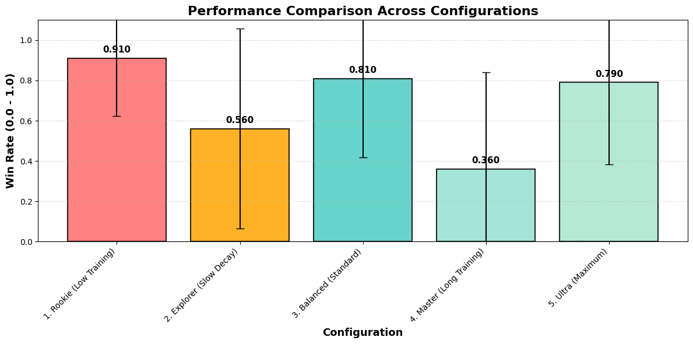
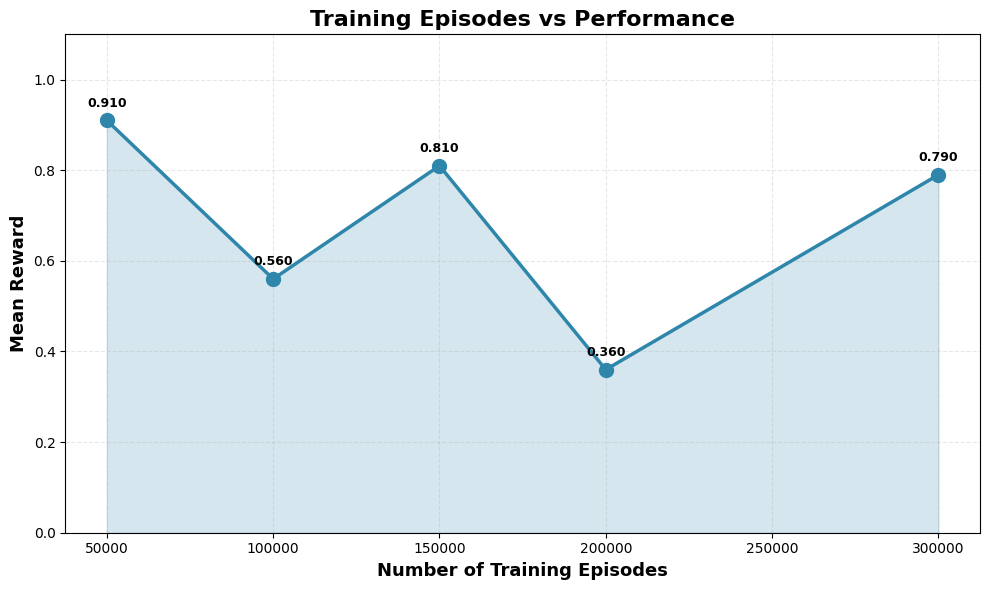
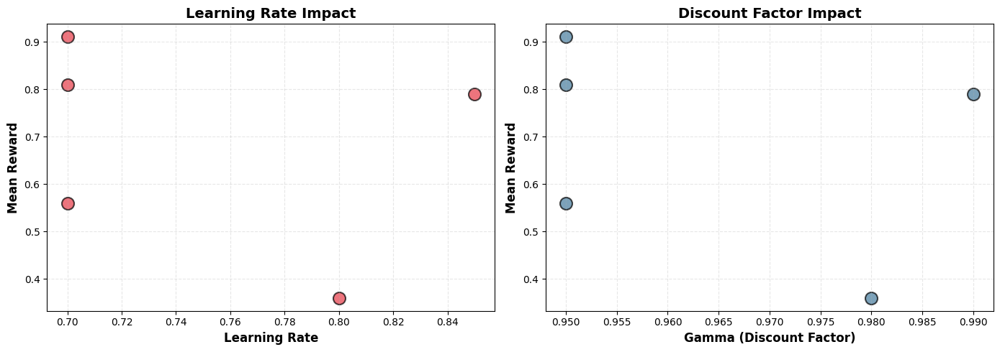
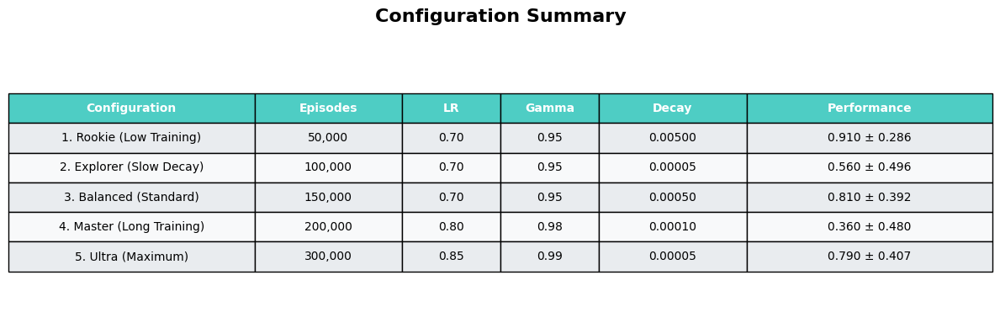

# 🎯 Q-Learning from Scratch: FrozenLake ⛄ & Taxi-v3 🚕

This repository contains my solution for **Unit 2** of the [Hugging Face Deep Reinforcement Learning Course](https://huggingface.co/deep-rl-course/unit2/introduction).

I implemented the **Q-Learning algorithm from scratch** using pure **Python and NumPy** to master two classic reinforcement learning environments. This project demonstrates a deep understanding of the **Bellman Equation**, **Temporal Difference Learning**, and the **exploration-exploitation trade-off**.

<br>

## 📚 What this unit explores

In this unit I focused on the core ideas behind **value-based reinforcement learning** and how they differ from other strategies for finding optimal policies:

- **Policy-based vs. value-based methods** – Here I work with **value-based** methods: instead of directly outputting actions with a policy network, I train a value function and then derive a policy from it.
- **State-value vs. action-value functions** – Q-Learning uses an **action-value function** \(Q(s, a)\), which estimates the expected return for each state–action pair and lets us build a policy by choosing the best action per state.
- **Epsilon-greedy vs. greedy strategies** – During training I use an **epsilon-greedy** strategy (a mix of exploration and exploitation), while at evaluation time I switch to a purely **greedy** policy that always picks the best-known action.
- **Off-policy vs. on-policy** – Q-Learning is an **off-policy** algorithm: the behavior policy (epsilon-greedy) used to explore is different from the greedy policy implicit in the Q-table.
- **Monte Carlo vs. Temporal Difference (TD)** – Instead of waiting until the end of an episode like in Monte Carlo methods, Q-Learning uses **TD updates**: it learns **at every step**, bootstrapping from its own current value estimates.

These concepts all come together in a single algorithm that learns a robust policy from scratch in both deterministic and stochastic environments.

<br>

## 🧠 Understanding Q-Learning

Q-Learning is a **model-free, off-policy** reinforcement learning algorithm that learns the optimal action-value function (Q-function) by iteratively updating a Q-table. The algorithm uses the Bellman equation to propagate rewards backward through state-action pairs.

<div align="center">


*Q-Learning Algorithm Pseudocode*

</div>

**Key Concepts:**
- **Q-Table**: A lookup table storing expected future rewards for each state-action pair
- **Epsilon-Greedy Policy**: Balances exploration (trying random actions) vs exploitation (using learned knowledge)
- **Bellman Equation**: Updates Q-values based on immediate reward + discounted future value
- **Off-Policy Learning**: Learns the optimal policy while following an exploratory policy

<br>

---

## 📊 Project Overview

### 🛠️ Tech Stack & Libraries

* 🐍 **Python & NumPy** – Core logic and matrix manipulation (no high-level RL libraries)
* 🏋️ **[Gymnasium](https://gymnasium.farama.org/)** – Standard API for RL environments
* 📊 **Matplotlib & Pandas** – Visualization and analysis
* 🎬 **ImageIO** – Video generation for agent demonstrations

### 🎮 Environments Solved

| Environment | Description | State Space | Action Space | Link |
| :--- | :--- | :--- | :--- | :--- |
| **FrozenLake-v1** ❄️ | Navigate a slippery grid to reach the goal without falling into holes | 16 (4x4) | 4 (Up/Down/Left/Right) | [Documentation](https://gymnasium.farama.org/environments/toy_text/frozen_lake/) |
| **Taxi-v3** 🚖 | Pick up passengers and drop them off at correct locations efficiently | 500 | 6 (Move + Pickup/Dropoff) | [Documentation](https://gymnasium.farama.org/environments/toy_text/taxi/) |

<br>

---

## Part 1: FrozenLake ⛄ (Non-Slippery Version)

### 🎯 Objective

Train a Q-Learning agent to navigate from the starting position (S) to the goal (G) on a **deterministic** 4x4 grid, avoiding holes (H) and walking only on frozen tiles (F).

### ⚙️ Implementation Details

**Environment Configuration:**
- `map_name="4x4"`: 4x4 grid version
- `is_slippery=False`: **Deterministic** environment (agent always moves in intended direction)
- `render_mode="rgb_array"`: For video recording

**Hyperparameters:**
- **Training Episodes**: 10,000
- **Learning Rate (α)**: 0.7
- **Discount Factor (γ)**: 0.95
- **Max Steps per Episode**: 99
- **Epsilon Decay**: Exponential from 1.0 → 0.05
- **Decay Rate**: 0.0005

**Key Functions Implemented:**
- `initialize_q_table()`: Creates Q-table initialized to zeros
- `epsilon_greedy_policy()`: Exploration-exploitation balance
- `greedy_policy()`: Pure exploitation (used during evaluation)
- `train()`: Main Q-Learning training loop with Bellman updates
- `evaluate_agent()`: Performance evaluation over 100 episodes

### 📈 Results

<div align="center">

| Metric | Value | Description |
| :--- | :--- | :--- |
| **Mean Reward** | **1.00** ± 0.00 | Perfect success rate (100%) |
| **Environment** | `FrozenLake-v1` (4x4, non-slippery) | Deterministic version |
| **Status** | ✅ **Solved** | Agent consistently reaches goal |

*Model Hub:* [MykhailoMatsyshyn/q-FrozenLake-v1-4x4-noSlippery](https://huggingface.co/MykhailoMatsyshyn/q-FrozenLake-v1-4x4-noSlippery)

</div>

### 🎥 Agent Demonstration

The agent learns the optimal deterministic path from start to goal:

<div align="center">
  <video src="https://github.com/user-attachments/assets/c3a439ab-9388-452a-809b-f9468c4debc1" controls="controls" style="max-width: 100%;">
  </video>
</div>

**Key Insight:** In the deterministic version, the agent quickly learns the shortest path since there's no randomness. The Q-table converges to optimal values, allowing the agent to reach the goal with 100% success rate.

<br>

---

## Part 2: FrozenLake ⛄ (Slippery Version) - The Real Challenge

### 🌊 Stochastic Environment Challenge

The **slippery version** (`is_slippery=True`) introduces **stochasticity** into the environment, making it significantly more challenging. When the agent chooses an action (e.g., **Right**), there's only a **33.3% chance** it moves in the intended direction. The remaining 66.7% is split equally between the two perpendicular directions.

<div align="center">


*Custom 5x5 FrozenLake Map: The Minefield*

</div>

### ⚖️ Deterministic vs. Stochastic Comparison

| Feature | Non-Slippery (`False`) | Slippery (`True`) |
| :--- | :--- | :--- |
| **Nature** | **Deterministic** | **Stochastic** |
| **Control** | Perfect control (100%) | Partial control (~33%) |
| **Strategy** | Shortest path (can walk on edges) | **Safe path** (avoids edges to prevent accidental falls) |
| **Difficulty** | Easy | **Hard** |
| **Agent Behavior** | Moves directly and predictably | **Gets "thrown around"** - doesn't move straight, requires longer training |

### 🔬 Hyperparameter Comparison Experiment

I conducted a comprehensive experiment comparing **5 different hyperparameter configurations** to understand their impact on learning in a stochastic environment:

#### 📊 Configuration Details

<div align="center">

| Configuration | Episodes | Learning Rate | Gamma | Decay Rate | Performance |
| :--- | :--- | :--- | :--- | :--- | :--- |
| **🥇 1. Rookie (Low Training)** | 50,000 | 0.7 | 0.95 | 0.005 | **0.910 ± 0.286** |
| **🥈 3. Balanced (Standard)** | 150,000 | 0.7 | 0.95 | 0.0005 | 0.810 ± 0.392 |
| **🥉 5. Ultra (Maximum)** | 300,000 | 0.85 | 0.99 | 0.00005 | 0.790 ± 0.407 |
| **4. Explorer (Slow Decay)** | 100,000 | 0.7 | 0.95 | 0.00005 | 0.560 ± 0.496 |
| **5. Master (Long Training)** | 200,000 | 0.8 | 0.98 | 0.0001 | 0.360 ± 0.480 |

</div>

#### 🏆 Final Rankings

```
🥇 1. Rookie (Low Training)       → 0.910 ± 0.286
🥈 3. Balanced (Standard)         → 0.810 ± 0.392
🥉 5. Ultra (Maximum)             → 0.790 ± 0.407
4. 2. Explorer (Slow Decay)       → 0.560 ± 0.496
5. 4. Master (Long Training)      → 0.360 ± 0.480
```

**💎 Best Configuration:** **1. Rookie (Low Training)**
- **Performance**: 0.910 (91% win rate)
- **Episodes**: 50,000

### 📈 Visualization & Analysis

#### 1. Performance Comparison Chart

<div align="center">



</div>

This chart benchmarks the performance of all **5 Q-Learning agents** on the slippery FrozenLake environment.

**The Result:** The **"Rookie"** configuration (Configuration 1) emerged as the clear winner with a **91% win rate**, significantly outperforming more complex setups.

- **Top Performer:** `Rookie` (50k episodes, LR = 0.7) → **0.910**
- **Worst Performer:** `Master` (200k episodes, LR = 0.8) → **0.360**

**Insight:** In a highly random environment, more aggressive agents often fail because they **overreact to accidental slips**. The simpler agent found the safe path and stuck to it.

#### 2. Training Episodes vs. Performance

<div align="center">



</div>

This chart reveals a counter‑intuitive finding: **more training does not always mean better results**.

- **Early peak:** The agent reached near‑optimal performance after just **50,000 episodes**.
- **Overfitting to noise:** Beyond ~150k episodes (especially in the **\"Master\"** config), performance **dropped sharply**. The agent started to \"hallucinate\" patterns in random ice slips and gradually **unlearned** the correct strategy.

#### 3. Hyperparameter Impact Analysis

<div align="center">



</div>

This pair of scatter plots shows how **Learning Rate** and **Gamma** influence stability and performance:

1. **Learning Rate (left chart):** Lower LR (`0.7`) produced the most stable and high‑scoring agents. Higher LR (`0.8+`) made learning **chaotic**—the agent changed its policy too aggressively after every random slip.\
2. **Gamma (right chart):** A moderate Gamma (`0.95`) worked best. On unpredictable terrain, it is more important to **survive the next few steps** than to over‑optimize for distant future rewards.

#### 4. Experiment Results Summary

<div align="center">



*Complete configuration comparison table*

</div>

### 🎬 Agent Behavior Comparison Videos

Watch how different hyperparameter configurations affect agent behavior. Notice how the agent **doesn't move straight** in the slippery version - it gets "thrown around" and requires more careful navigation:

<div align="center">

<table>
<tr>
<td align="center" width="50%">
<strong>🥇 1. Rookie (Low Training)</strong><br/>
<strong>Win Rate: 91.0%</strong><br/>
<video src="videos_comparison/1_Rookie_Low_Training.mp4" controls="controls" style="max-width: 100%;"></video>
</td>
<td align="center" width="50%">
<strong>2. Explorer (Slow Decay)</strong><br/>
<strong>Win Rate: 56.0%</strong><br/>
<video src="videos_comparison/2_Explorer_Slow_Decay.mp4" controls="controls" style="max-width: 100%;"></video>
</td>
</tr>
<tr>
<td align="center" width="50%">
<strong>🥈 3. Balanced (Standard)</strong><br/>
<strong>Win Rate: 81.0%</strong><br/>
<video src="videos_comparison/3_Balanced_Standard.mp4" controls="controls" style="max-width: 100%;"></video>
</td>
<td align="center" width="50%">
<strong>5. Master (Long Training)</strong><br/>
<strong>Win Rate: 36.0%</strong><br/>
<video src="videos_comparison/4_Master_Long_Training.mp4" controls="controls" style="max-width: 100%;"></video>
</td>
</tr>
<tr>
<td align="center" colspan="2">
<strong>🥉 5. Ultra (Maximum)</strong><br/>
<strong>Win Rate: 79.0%</strong><br/>
<video src="videos_comparison/5_Ultra_Maximum.mp4" controls="controls" style="max-width: 100%;"></video>
</td>
</tr>
</table>

</div>

### 💡 Key Insights from the Experiment

#### 1. 🔑 The "Less is More" Paradox

The **shortest training session (50k episodes) produced the best agent** with a 91% win rate. This counterintuitive result reveals an important lesson:

- **Over-training Risk**: In stochastic environments, excessive training can cause the agent to overreact to random slips
- **Early Convergence**: The "Rookie" agent found the safe path quickly and stuck to it
- **Stability Over Complexity**: Simple, stable hyperparameters outperformed aggressive configurations

#### 2. 🛡️ The High Learning Rate Trap

The **"Master" configuration** (Learning Rate = 0.8) performed the worst (36% win rate), demonstrating that:

- **High Learning Rate + Stochasticity = Disaster**: On slippery ice, a high learning rate causes the agent to overreact to random slips
- **Unlearning Good Strategies**: The agent effectively "unlearns" good strategies by over-correcting for random events
- **Stable Learning Rate (0.7) Wins**: Moderate learning rates provide better stability in uncertain environments

#### 3. 🗺️ Environment Design Matters

My initial attempts yielded 0% success rate due to a "death trap" bottleneck in the original map. After simplifying the layout:

- **Map Design is King**: The difference between 0% and 91% was primarily determined by map layout
- **Solvability First**: No amount of hyperparameter tuning can fix a fundamentally broken level design
- **Reward Shaping**: A negative penalty (-0.7) for falling into holes helped stabilize learning

#### 4. 📊 The Training Paradox Explained

| Configuration | Episodes | Result | Analysis |
| :--- | :--- | :--- | :--- |
| **Rookie** | 50k | **91%** ✅ | Found safe path, stuck to it |
| **Balanced** | 150k | 81% | Good but slightly over-trained |
| **Ultra** | 300k | 79% | Diminishing returns |
| **Master** | 200k | 36% ❌ | High LR caused instability |

**Conclusion**: In stochastic environments, **early stopping** and **stable hyperparameters** often outperform aggressive training schedules.

<br>

---

## Part 3: Taxi-v3 🚖

### 🎯 Objective

Train a Q-Learning agent to autonomously:
1. Navigate to passenger's pickup location
2. **Pick up** the passenger
3. Navigate to passenger's destination
4. **Drop off** the passenger

### 🗺️ Environment Details

**State Space**: 500 discrete states
- 25 possible taxi positions (5x5 grid)
- 5 passenger locations (4 destinations + in taxi)
- 4 destination locations

**Action Space**: 6 discrete actions
- 0: Move South
- 1: Move North
- 2: Move East
- 3: Move West
- 4: **Pickup** passenger
- 5: **Dropoff** passenger

**Reward Function:**
- **-1** per step (encourages efficiency)
- **+20** for successful delivery
- **-10** for illegal pickup/dropoff actions

### ⚙️ Hyperparameters

- **Training Episodes**: 25,000
- **Learning Rate (α)**: 0.7
- **Discount Factor (γ)**: 0.95
- **Max Steps per Episode**: 99
- **Epsilon Decay**: Exponential from 1.0 → 0.05
- **Decay Rate**: 0.005
- **Evaluation Seed**: Fixed seed array for reproducible evaluation

### 📈 Results

<div align="center">

| Metric | Value | Description |
| :--- | :--- | :--- |
| **Mean Reward** | **7.52** ± 2.74 | Average reward per episode |
| **Environment** | `Taxi-v3` | Standard taxi environment |
| **Status** | ✅ **Solved** | Agent successfully completes tasks |

*Model Hub:* [MykhailoMatsyshyn/q-Taxi-v3](https://huggingface.co/MykhailoMatsyshyn/q-Taxi-v3)

</div>

### 🎥 Agent Demonstration

Watch the trained agent efficiently pick up and deliver passengers:

<div align="center">
  <video src="https://github.com/user-attachments/assets/ee69ff81-ce53-4451-bffe-6786528357f6" controls="controls" style="max-width: 100%;">
  </video>
</div>

**Key Insight:** The agent learns to minimize steps (each step costs -1) while maximizing the delivery reward (+20). The Q-table encodes efficient navigation strategies for all possible passenger-destination combinations.

<br>

---

## Part 4: Load from Hub 🔽

### 🤗 Hugging Face Hub Integration

One of the amazing features of the Hugging Face Hub is the ability to easily load and test pre-trained models from the community. This allows for:

- **Model Sharing**: Share your trained agents with others
- **Reproducibility**: Load exact model configurations
- **Comparison**: Test different implementations on the same environment

### 📥 Loading Models

You can load any Q-Learning model from the Hub using:

```python
from huggingface_hub import hf_hub_download
import pickle

def load_from_hub(repo_id: str, filename: str):
    pickle_model = hf_hub_download(repo_id=repo_id, filename=filename)
    with open(pickle_model, 'rb') as f:
        return pickle.load(f)
```

### 🎬 Demonstration Videos

I loaded and tested pre-trained models from the Hub, recording successful episodes to compare with my implementations:

#### FrozenLake Model from Hub

**Model:** [ThomasSimonini/q-FrozenLake-v1-no-slippery](https://huggingface.co/ThomasSimonini/q-FrozenLake-v1-no-slippery)  
**Author:** Thomas Simonini (Course Instructor)

<div align="center">
  <video src="video_frozenlake/frozenlake-win-hunt-episode-0.mp4" controls="controls" style="max-width: 100%;">
  </video>
</div>

#### Taxi Model from Hub

**Model:** [ThomasSimonini/q-Taxi-v3](https://huggingface.co/ThomasSimonini/q-Taxi-v3)  
**Author:** Thomas Simonini (Course Instructor)

<div align="center">
  <video src="video_taxi/taxi-win-hunt-episode-0.mp4" controls="controls" style="max-width: 100%;">
  </video>
</div>

**Note:** The notebook file is quite large, and some outputs may not display properly in certain viewers. The README provides a comprehensive overview of all results, visualizations, and video demonstrations.

<br>

---

## 📚 Personal takeaways from Unit 2

For me, this unit was all about **seeing theory turn into behavior**. It’s one thing to read about Bellman equations and Q-tables, and another to watch a tiny agent stumble, learn, and finally glide safely across a slippery lake—or pick up and drop off passengers like a pro in `Taxi-v3`.

I clearly felt the difference between **deterministic and stochastic worlds**: on the non‑slippery lake the agent just needs to find the shortest path, but on the slippery map it must learn a *safe* path that respects randomness. That forced me to think much more carefully about **hyperparameters**, environment design, and how fragile learning can be when the world is noisy.

Finally, integrating everything with the **Hugging Face Hub** (pushing my own Q-Learning agents and loading others) made the project feel like a real MLOps workflow rather than an isolated notebook. Unit 2 left me with an intuitive feel for value-based RL: how Q-Learning reasons about actions, and why a \"simple\" tabular method can still be surprisingly powerful when engineered with care.

<br>

---

## 🔗 References & Resources

* [Hugging Face Deep RL Course](https://huggingface.co/deep-rl-course)
* [Unit 2: Introduction to Q-Learning](https://huggingface.co/deep-rl-course/unit2/introduction)
* [Gymnasium Documentation](https://gymnasium.farama.org/)
* [FrozenLake Environment](https://gymnasium.farama.org/environments/toy_text/frozen_lake/)
* [Taxi-v3 Environment](https://gymnasium.farama.org/environments/toy_text/taxi/)

### 📦 Model Repositories

* [q-FrozenLake-v1-4x4-noSlippery](https://huggingface.co/MykhailoMatsyshyn/q-FrozenLake-v1-4x4-noSlippery)
* [q-Taxi-v3](https://huggingface.co/MykhailoMatsyshyn/q-Taxi-v3)

